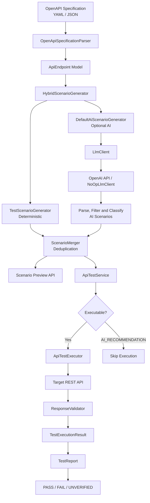

# AI QA Agent — System Architecture

The AI QA Agent uses a hybrid approach to generate REST API test scenarios from OpenAPI specifications, execute supported scenarios, and report the results.

## Architecture diagram

## Main components

| Component | Responsibility |
|---|---|
| OpenApiSpecificationParser | Parses API definitions and response specifications |
| TestScenarioGenerator | Generates deterministic positive, negative, and boundary scenarios |
| DefaultAiScenarioGenerator | Uses an LLM to suggest additional API testing scenarios |
| HybridScenarioGenerator | Combines deterministic and AI-generated scenarios |
| ScenarioMerger | Deduplicates generated scenarios |
| ApiTestService | Coordinates test generation and execution |
| ApiTestExecutor | Sends HTTP requests to the target API |
| ResponseValidator | Compares actual and expected HTTP status codes |
| TestReport | Aggregates execution results and calculates the verified pass rate |

## Scenario classifications

- **Deterministic:** Generated from documented OpenAPI constraints.
- **AI_EXECUTABLE:** AI-generated scenarios that can be executed automatically.
- **AI_RECOMMENDATION:** Scenarios requiring external setup or state; returned for review but not automatically executed.

## Execution outcomes

- **PASS:** Actual status matches the expected status.
- **FAIL:** Actual status differs from the expected status.
- **UNVERIFIED:** The request was executed, but a definitive expected status was unavailable.

## Reliability and limitations

- Deterministic generation works without an OpenAI API key.
- AI failures fall back to deterministic generation.
- AI integration requires an enabled configuration and available API credits.
- The demo API uses in-memory state. Repeated executions may produce different results when tests modify or delete records.
- Test-data isolation and automated setup/teardown are future improvements.
